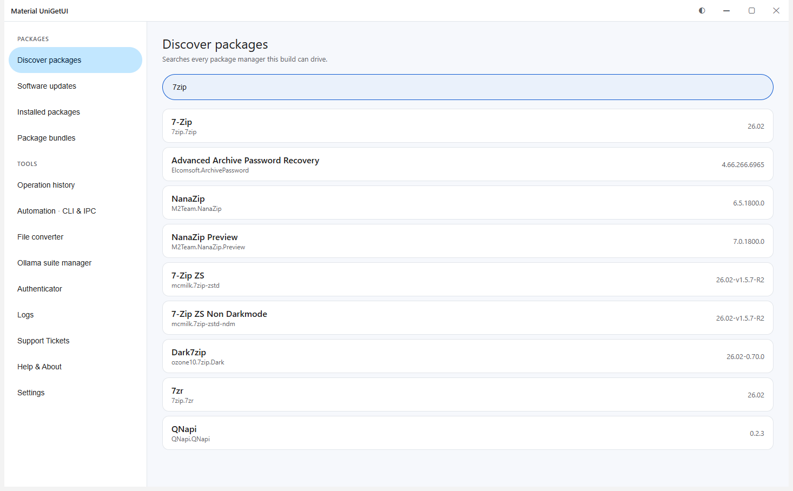
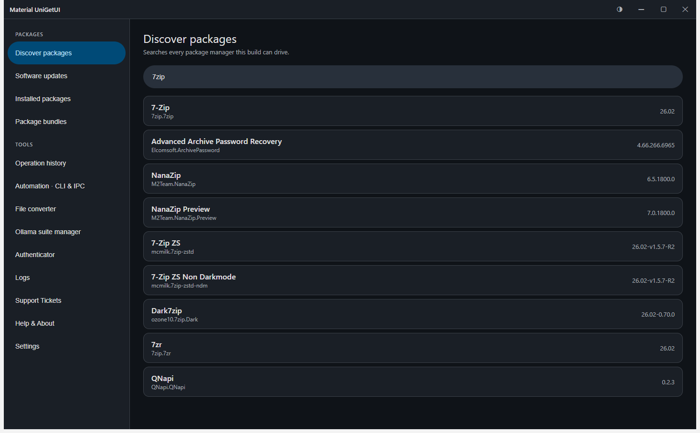
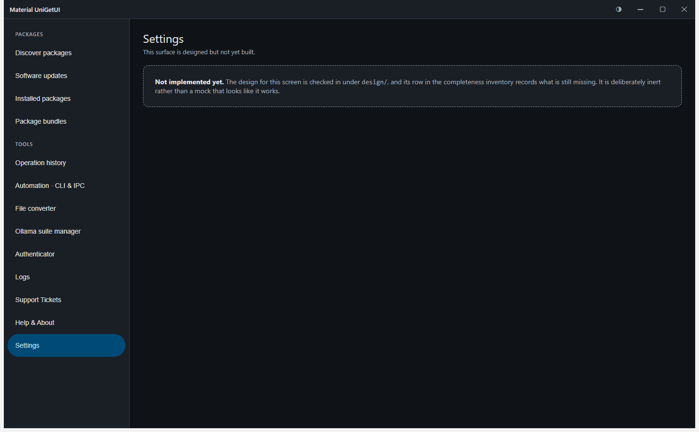

<div align="center">

# Material UniGetUI

**The Material Design 3 interface for your package managers.**

[Day Teet Hui](https://ding-ding-projects.github.io/material-unigetui/) ·
[Roadmap](ROADMAP.md) ·
[Handoff](HANDOFF.md) ·
[Design reference](design/)

</div>

> [!WARNING]
> **Not released.** There is no installer to download yet. This repository
> contains a working application you can build and run, a complete design, and
> an inventory that says exactly how much of the intended product exists. That
> figure is currently **9 of 434 evidence records**. The roadmap is not
> aspirational marketing — it is the honest remainder.

---

## What this is

A rewrite of the [UniGetUI](https://github.com/Devolutions/UniGetUI) interface
in Material Design 3, driving Windows package managers through **natively
reimplemented drivers**. UniGetUI itself is pinned here as a shallow read-only
submodule at `v2026.2.7` and is used as a reference for command lines and output
parsing — none of its C# is ever executed.

<details open>
<summary><b>Screenshots</b> — captured from the real built application</summary>

Every image below was taken from the built artifact running on a hidden desktop,
not from the design file and not from a mockup.

**Discover — live results from the real `winget` catalogue**



**The same screen in dark theme** — one token layer, both palettes lifted verbatim from the design



**A route that is not built yet, saying so**



There is deliberately no screenshot of the Installed or Software updates screens
populated: those list the machine's real software inventory, which is personal
data and does not belong in a public repository.

</details>

<details>
<summary><b>Build and run it</b></summary>

```bash
npm install
node script/ensure-electron-binary.mjs
npm run build
npm start
```

`ensure-electron-binary.mjs` exists because npm's install-script gate can leave
the electron package present with no binary underneath it — a state that reads
as "electron is not installed" while the folder sits right there.

</details>

<details>
<summary><b>Verify it</b></summary>

```bash
npm test                 # unit tests, including one that spawns the real winget
npm run test:negative    # breaks the guard on purpose and requires it to go red
npx electron script/verify-site.cjs   # drives the real site and checks behaviour
```

`test:negative` is the one that matters. A guard nobody has watched fail is a
decoration; this one is broken nine different ways on every run and must catch
all nine.

</details>

<details>
<summary><b>What actually works today</b></summary>

- The application builds, launches, and navigates all 13 of its routes.
- **Discover**, **Software updates** and **Installed** read live data through the
  native WinGet driver.
- The renderer is isolated: `contextIsolation: true`, no node integration, and a
  preload bridge that exposes named calls and never a generic channel forwarder.
- A custom Material title bar; the operating-system frame is never product chrome.
- Light and dark themes from a single token contract.
- The Day Teet Hui, generated from the same inventory the tests enforce, with
  10/10 behaviour checks passing.

</details>

<details>
<summary><b>What is deliberately not built yet</b></summary>

- Ten of the eleven in-scope package managers. WinGet only, so far.
- Installing, updating and uninstalling from the interface. The operations queue
  exists and is tested; nothing in the UI triggers it.
- Bundles, history, automation, converter, Ollama, authenticator, logs, tickets,
  about, and settings. Each says so on screen rather than pretending.
- Most of the universal feature contracts. All 62 are in the inventory with
  written reasons.
- No installer has been produced or released.

</details>

<details>
<summary><b>Package managers in scope</b></summary>

WinGet · Scoop · Chocolatey · Pip · Npm · Cargo · Dotnet · PowerShell ·
PowerShell 7 · Vcpkg · Bun

Apt, Dnf, Flatpak, Homebrew, Pacman and Snap exist upstream and are deliberately
out of scope while delivery targets Windows.

</details>

## A note on signing

Artifacts from this project are and will remain **unsigned**. When an installer
eventually ships it will trigger an unknown-publisher warning on Windows. That
is stated here rather than discovered at install time; nothing in this repository
claims a signature it does not have.

## Repository setup that still needs a human

`social-preview.png` is committed at the repository root, but GitHub's social
preview is a repository setting rather than a file, and it is not exposed by the
API — so it cannot be set from here. To make a pasted link show the picture:

**Settings → General → Social preview → Upload an image → `social-preview.png`**

## Licence

MIT. UniGetUI is MIT and is included only as a reference submodule.
